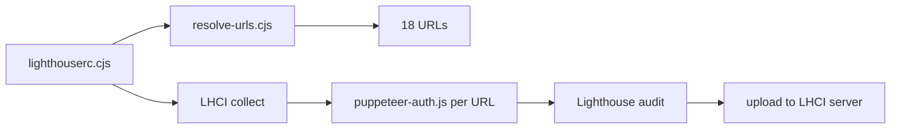

# Realworld Angular — Lighthouse CI

This package serves two roles for the [Realworld Angular](https://github.com/realworld-angular/realworld-angular) frontend:

1. **LHCI server** — a hosted [Lighthouse CI server](https://github.com/GoogleChrome/lighthouse-ci/blob/main/docs/server.md) that stores audit history (PostgreSQL on Railway).
2. **LHCI client config** — collection settings that audit [realworld-angular](https://www.realworldangular.org) across its main routes, with separate runs for guest, customer, and admin sessions.

The Angular app lives in `../realworld-angular`. This folder only contains the server and the CI configuration that drives audits against production (or another environment via env vars).

## Running audits locally

```bash
pnpm install
pnpm lhci:autorun   # resolve URLs, collect, upload
```

Or step by step:

```bash
pnpm lhci:prepare   # fetch API + write .lhci/urls.json
pnpm lhci:collect
pnpm lhci:upload    # requires LHCI_BUILD_TOKEN
```

`lhci:prepare` is required because `lhci autorun` loads `lighthouserc.cjs` **synchronously** — it cannot use an async config export and would otherwise look for a local `dist/` folder. URL list is written to `.lhci/urls.json` first.

`@lhci/cli` is a dev dependency; the server runtime uses `@lhci/server` (see `index.js`).

## GitHub Actions

Workflow: [`.github/workflows/lhci.yml`](.github/workflows/lhci.yml)

Triggered manually from **Actions → Lighthouse CI → Run workflow** (`workflow_dispatch`).

| Input | Default | Description |
| ----- | ------- | ----------- |
| `report_name` | — (required) | Build label on the LHCI server (`LHCI_BUILD_CONTEXT__COMMIT_MESSAGE`), e.g. `v1.2.0 regression` or `pre-deploy 2026-05-31` |
| `number_of_runs` | `3` | Passed to `LHCI_NUMBER_OF_RUNS` |
| `upload` | `true` | `pnpm lhci:autorun` when on; `pnpm lhci:collect` only when off |

The workflow also sets `LHCI_BUILD_CONTEXT__AUTHOR` (GitHub actor) and `LHCI_BUILD_CONTEXT__EXTERNAL_BUILD_URL` (link back to the Actions run) when uploading.

Locally, use the same variables before `pnpm lhci:autorun`:

```bash
export LHCI_BUILD_CONTEXT__COMMIT_MESSAGE="My audit label"
pnpm lhci:autorun
```

**Repository secret (required when upload is enabled):**

| Secret | Description |
| ------ | ----------- |
| `LHCI_BUILD_TOKEN` | Build token from the LHCI server project settings |

The job audits production (`www.realworldangular.org` / `api.realworldangular.org`) using the seeded demo accounts documented below. Expect roughly 1–2 hours for a full run (18 URLs × multiple Lighthouse runs each).

GitHub runners do not include Chrome by default. The workflow installs Chromium via Puppeteer (`puppeteer` devDependency + `puppeteer browsers install chrome`) and sets `CHROME_PATH` for Lighthouse and the auth script.

pnpm 10+ blocks install scripts by default. This repo allowlists Puppeteer in [`pnpm-workspace.yaml`](pnpm-workspace.yaml) (`allowBuilds.puppeteer: true`), which avoids `ERR_PNPM_IGNORED_BUILDS` in CI. If you add other native deps later, run `pnpm approve-builds` and commit the updated file.

Locally, after `pnpm install`, run once:

```bash
pnpm exec puppeteer browsers install chrome
export CHROME_PATH="$(pnpm exec node -p "require('puppeteer').executablePath()")"
```

## Audit logic

Audits are driven by `lighthouserc.cjs` and the `lhci/` helpers. The flow is:



### 1. Route catalog (`lhci/routes.cjs`)

Every path to audit is listed once with a **persona** (who must be logged in before Lighthouse runs):

| Persona | Default account | Role |
| -------- | ---------------- | ----- |
| `guest` | — | Unauthenticated |
| `customer` | `client@pizza.dev` | `CUSTOMER` |
| `admin` | `admin@pizza.dev` | `PIZZERIA_ADMIN` |

Some routes also declare `setup: 'cart'` (see below).

Paths with `{pizzeriaId}` or `{orderId}` are templates; they are expanded when URLs are built.

### 2. URL resolution (`lhci/resolve-urls.cjs`)

Before collection starts, `pnpm lhci:prepare` runs `buildUrls()` and writes `.lhci/urls.json`. Then `lighthouserc.cjs` loads that list. The resolver:

- Fetches the public pizzeria list from the API and picks the first pizzeria that has at least one pizza (for `/pizzerias/{pizzeriaId}`).
- Uses the stable seeded order id `seed-order-delivered` for `/orders/{orderId}` (owned by the demo customer in production seed data).
- Prefixes each path with `LHCI_BASE_URL` (default `https://www.realworldangular.org`).

This yields **18 URLs** per collect run.

### 3. Auth and setup (`lhci/puppeteer-auth.js`)

LHCI runs `puppeteer-auth.js` **before each URL**. The script:

1. Parses the target pathname and looks up persona/setup in `routes.cjs`.
2. Opens the app origin so API calls share the correct cookie domain.
3. **Guest** — calls `POST /api/auth/logout` so no session cookie is sent.
4. **Customer / admin** — calls `POST /api/auth/login` with credentials from `lhci/constants.cjs` (seeded demo users; overridable via env).
5. **Cart setup** (`setup: 'cart'`) — after login, opens a pizzeria detail page, adds one pizza via the UI (order modal), so `/checkout/*` routes pass the `cartNotEmptyGuard`.

LHCI invokes the script as `async (browser, context) => …` — create a page with `browser.newPage()`, then `page.close()` when done so Lighthouse can open its own tab. Auth cookies persist on the shared browser (`disableStorageReset: true`).

Auth uses the real API (`LHCI_API_BASE_URL`, default `https://api.realworldangular.org`) with `credentials: 'include'`, matching how the Angular app stores the `access_token` cookie.

### 4. Collection settings (`lighthouserc.cjs`)

- **Runs per URL:** `LHCI_NUMBER_OF_RUNS` (default `3`) — median scores are computed across runs.
- **Preset:** `desktop`
- **Skipped audit:** `bf-cache` (often flaky in automated runs)
- **Upload:** results go to the LHCI server (`LHCI_SERVER_BASE_URL` + `LHCI_BUILD_TOKEN`)

## Routes audited

### Guest (9)

| Path | Notes |
| ------ | ------ |
| `/pizzerias` | Pizzeria list |
| `/pizzerias/{pizzeriaId}` | Detail + menu |
| `/cart` | Empty cart |
| `/terms-and-conditions` | Legal |
| `/unauthorized` | 403 page |
| `/lhci-not-found` | 404 (intentional bad path) |
| `/auth/login` | Login form |
| `/auth/register` | Customer registration |
| `/auth/register-pizzeria` | Owner registration |

### Customer (6)

| Path | Notes |
| ------ | ------ |
| `/profile` | Account |
| `/orders` | Order list |
| `/orders/seed-order-delivered` | Order detail |
| `/checkout/delivery` | Cart seeded in Puppeteer |
| `/checkout/schedule` | Cart seeded; may redirect if delivery step incomplete |
| `/checkout/review` | Cart seeded; may redirect if prior steps incomplete |

### Admin (3)

| Path | Notes |
| ------ | ------ |
| `/pizzerias/admin/pizzas` | Menu management |
| `/pizzerias/admin/configuration` | Pizzeria settings |
| `/orders/admin` | Shop orders |

### Not audited

| Path | Reason |
| ------ | -------- |
| `/` | Role-based redirect only |
| `/pizzerias/admin/new` | Demo admin already owns a pizzeria (`noPizzeriaGuard`) |
| `/invite/:token` | Not implemented in current Angular routes |

To add or remove routes, edit `lhci/routes.cjs`. If you add placeholders, resolve them in `lhci/resolve-urls.cjs`.

## Environment variables

| Variable | Default | Purpose |
| -------- | -------- | -------- |
| `LHCI_BASE_URL` | `https://www.realworldangular.org` | Frontend origin |
| `LHCI_API_BASE_URL` | `https://api.realworldangular.org` | API for login/logout |
| `LHCI_CUSTOMER_EMAIL` | `client@pizza.dev` | Customer login |
| `LHCI_CUSTOMER_PASSWORD` | `password123` | Customer login |
| `LHCI_ADMIN_EMAIL` | `admin@pizza.dev` | Admin login |
| `LHCI_ADMIN_PASSWORD` | `password123` | Admin login |
| `LHCI_NUMBER_OF_RUNS` | `3` | Lighthouse runs per URL |
| `LHCI_SERVER_BASE_URL` | Railway production URL | Upload target |
| `LHCI_BUILD_TOKEN` | — | Required for upload (from LHCI server project) |
| `LHCI_BUILD_CONTEXT__COMMIT_MESSAGE` | (from git / CI) | **Build label** in the LHCI server UI |
| `LHCI_BUILD_CONTEXT__AUTHOR` | (from git / CI) | Shown on the build |
| `LHCI_BUILD_CONTEXT__EXTERNAL_BUILD_URL` | (optional) | Link from the build to your CI job |

Server deployment (`index.js`) uses `PORT` and `DATABASE_URL` for PostgreSQL storage.

## Project layout

```
realworld-angular-lhci-server/
├── index.js              # LHCI server (Railway)
├── lighthouserc.cjs      # LHCI client config (async URL list)
├── lhci/
│   ├── constants.cjs     # Base URLs + demo credentials
│   ├── routes.cjs          # Route catalog + persona mapping
│   ├── prepare-config.cjs  # Write .lhci/urls.json (run before autorun)
│   ├── resolve-urls.cjs    # Build full URL list for collect
│   └── puppeteer-auth.js   # Pre-audit login / cart setup
└── package.json
```

## Demo accounts

Credentials match the API seed data (`pnpm run db:seed` in `realworld-angular-api`):

- `client@pizza.dev` — customer with demo orders including `seed-order-delivered`
- `admin@pizza.dev` — pizzeria admin with an existing shop

Password for both: `password123`.

Audits target production by default; ensure seed users exist on the environment you point at, or override the `LHCI_*_EMAIL` / `LHCI_*_PASSWORD` variables.
